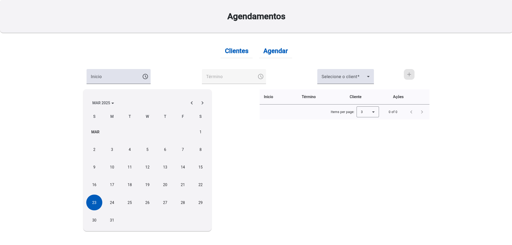

<div align="center">
  
  # Barbershop Appointments using Angular


</div>

## Resumo

Este projeto é uma aplicação web para gerenciar agendamentos em uma barbearia. O sistema permite que clientes marquem horários, visualizem serviços disponíveis e que os administradores gerenciem os agendamentos.

## Tecnologias Utilizadas

- **TypeScript:** Linguagem de programação
- **Angular:** Framework para construção de aplicações web
- **HTML:** Linguagem de marcação
- **SCSS:** Linguagem de estilo para CSS
- **Docker:** Plataforma de containerização
- **Shell Script:** Scripts para automação de tarefas

## Imagem



## Como Inicializar o Projeto

### Pré-requisitos

- Node.js, npm e AngularCLI instalados

### Passos para Inicializar

1. **Clone o repositório:**

   ```shell
   git clone https://github.com/maxjdev/Barbershop-Appointments-using-Angular.git
   cd Barbershop-Appointments-using-Angular
   ```

2. **Instale as dependências:**
   ```shell
   npm install
   ```

3. **Execute a aplicação:**
   ```shell
   ng serve
   ```
   
### Contruibuição
- Para contribuir, faça um fork deste repositório e envie suas alterações por meio de pull requests.
- Para relatórios de bugs ou sugestões de melhorias, abra uma issue na página do projeto.
